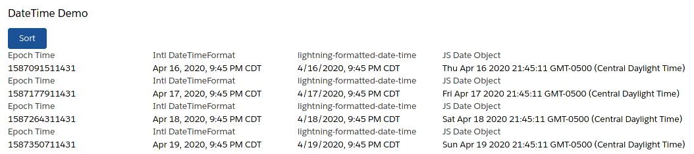

# sf-date-fun

Showcase conversions and formatting of Dates and Times between Apex, Javascript, and LWC Base Components.

## Formatting Opinion

The LWC Base Component, `lightning-formatted-date-time`, is a wrapper around Intl.DateTimeFormatter. By abstracting the Intl.DateTimeFormatter away, it may be marginally easier to use.

Knowing neither of these, the learning curve is identical. But direct access to the Intl.DateTimeFormatter means more options and greater control.

Knowing both of these, it's a question of where would you like the complexity / config? Would you prefer to have more code in your template (base component) or would you prefer more code in javascript (Intl)?

## Resources

 1. [Epoch Time](https://en.wikipedia.org/wiki/Epoch_(computing))
 1. [GMT vs UTC](https://www.timeanddate.com/time/gmt-utc-time.html)
 1. Javascript MDN
    * [Intl.DateTimeFormat](https://developer.mozilla.org/en-US/docs/Web/JavaScript/Reference/Global_Objects/DateTimeFormat)
    * [Intl.DateTimeFormat Options](https://developer.mozilla.org/en-US/docs/Web/JavaScript/Reference/Global_Objects/DateTimeFormat/DateTimeFormat)
 1. Salesforce
    * Apex - DateTime Class
        * [.getTime()](https://developer.salesforce.com/docs/atlas.en-us.apexcode.meta/apexcode/apex_methods_system_datetime.htm#apex_System_Datetime_getTime)
    * Lightning Component Library
        * [lightning-formatted-date-time](https://developer.salesforce.com/docs/component-library/bundle/lightning-formatted-date-time/example)